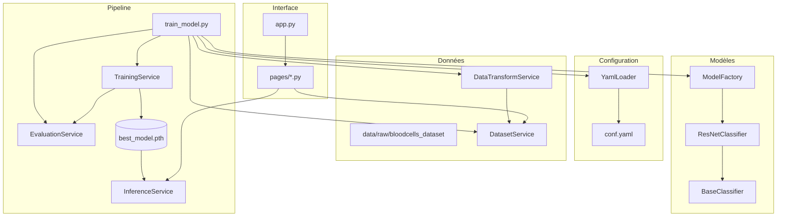

# Documentation du module `src`

## Vue d'ensemble

Le dossier `src/` regroupe l'ensemble de la logique applicative du projet **Blood Cell Classification**.
Il implémente une architecture en services respectant les principes SOLID, avec une configuration centralisée via `src/conf.yaml` et des pages Streamlit pour l'interface utilisateur.

## Organisation des dossiers

- `src/app.py` : point d'entrée Streamlit (layout principal, navigation).
- `src/pages/` : pages Streamlit (présentation, exploration, modèle, démo, etc.).
- `src/services/` : services métiers (transformations, dataset, entraînement, évaluation, inférence, configuration).
- `src/models/` : abstractions et implémentations de modèles (factory, base, ResNet).
- `src/pipe/` : pipeline d'entraînement orchestré (`train_model.py`).
- `src/conf.yaml` : configuration centralisée (chemins, hyperparamètres, modèles, augmentation).
- `src/assets/` : ressources statiques utilisées par l'UI.
- `src/notebooks/` : notebooks de recherche (non couverts ici).

## Services (`src/services/`)

- **`YamlLoader`** (`src/services/yaml_loader.py`) : charge `conf.yaml`, résout les chemins (`data_dir`, `logs_dir`, etc.) et expose des méthodes pour naviguer dans la configuration.
- **`DataTransformService`** (`src/services/data_transform_service.py`) : construit les pipelines de transformations Torchvision pour l'entraînement (avec augmentation) et la validation/test (normalisation uniquement).
- **`DatasetService`** (`src/services/dataset_service.py`) : prépare le dataset `ImageFolder`, effectue les splits train/val/test, crée les `DataLoader`, gère les sous-échantillonnages optionnels et calcule les poids de classes.
- **`TrainingService`** (`src/services/training_service.py`) : encapsule la boucle d'entraînement (optimisation Adam, suivi de la meilleure accuracy validation, sauvegarde de checkpoint).
- **`EvaluationService`** (`src/services/evaluation_service.py`) : évalue le modèle sur le jeu de test et retourne accuracy, prédictions et labels.
- **`InferenceService`** (`src/services/inference_service.py`) : fournit des méthodes de prédiction sur une image ou un batch, et une fabrique statique `load_from_checkpoint()` pour recharger un modèle entraîné.

## Modèles (`src/models/`)

- **`BaseClassifier`** : interface abstraite (obtenir le nombre de features, remplacer la tête de classification).
- **`ResNetClassifier`** : implémentation concrète basée sur Torchvision (support des variantes `resnet*`, gestion des poids préentraînés, remplacement du `fc`).
- **`ModelFactory`** : crée un modèle en fonction de la configuration (`model.name`, `pretrained`, `pretrained_weights`) et sélectionne le device (`cuda` ou `cpu`).

## Pipeline d'entraînement (`src/pipe/train_model.py`)

- Charge la configuration via `YamlLoader`.
- Construit les transformations (`DataTransformService`) et charge le dataset (`DatasetService`).
- Calcule les poids de classes et instancie le modèle via `ModelFactory`.
- Entraîne le modèle avec `TrainingService`, sauvegarde le meilleur checkpoint et évalue via `EvaluationService`.
- Enregistre les métriques (accuracy, pertes) dans `models/checkpoints/metrics.json`.

## Interface Streamlit (`src/app.py` & `src/pages/`)

- **`app.py`** : configure la page Streamlit (sidebar, intro) et affiche l'image d'accueil.
- **Pages** : chaque fichier `pages/*.py` correspond à un onglet Streamlit.
  - `1_Presentation_du_projet.py` : objectifs, contexte, données.
  - `2_Exploration_du_dataset.py` : analyse exploratoire interactive (statistiques, histogrammes, visualisation d'images) en s'appuyant sur `YamlLoader` pour trouver le dataset.
  - `3_Modele.py` : description du modèle, métriques et visualisation de performances.
  - `4_Demo.py` : interface de prédiction utilisant `InferenceService` et `best_model.pth`.
  - `5_Ameliorations_potentielles.py` : axes d'amélioration.
  - `6_Conclusion.py` : synthèse du projet.

## Configuration (`src/conf.yaml`)

- Section `paths` : centralise les chemins (`src`, `data`, `models/checkpoints`).
- Section `training` : hyperparamètres d'entraînement (batch size, epochs, seed, splits, subset_size).
- Section `model` : type de modèle et options de pré-entraînement.
- Section `augmentation` : paramètres d'augmentation pour l'entraînement (flip, rotation, color jitter).

## Flux global

1. Lancement du pipeline (`uv run train-model`) : configuration chargée, dataset préparé, modèle entraîné, checkpoint sauvegardé.
2. Lancement de Streamlit (`uv run streamlit run src/app.py`) : les pages consomment les services pour afficher l'exploration, les métriques et la démo d'inférence.
3. `InferenceService.load_from_checkpoint()` charge `best_model.pth` pour la démo interactive.
